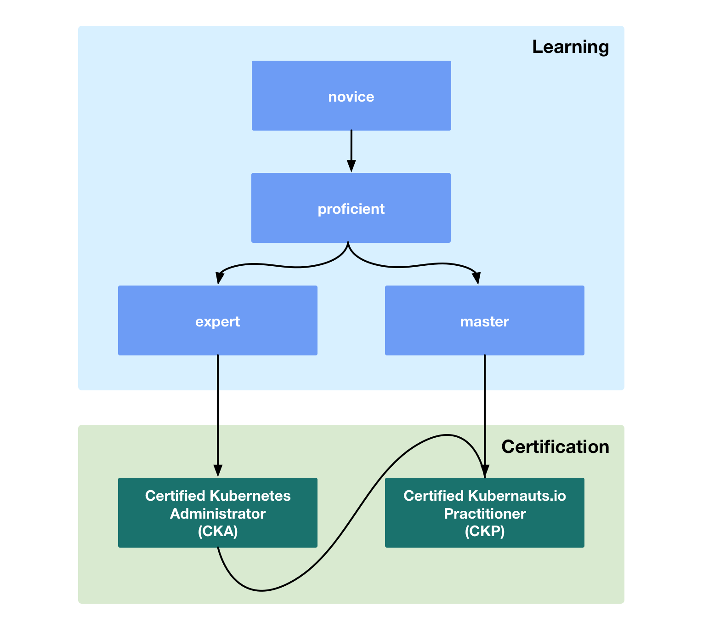

# Kubernauts Training

---

The [Kubernauts](https://kubernauts.io/) is a non-profit initiative that offers free training for [Kubernetes](https://kubernetes.io) and [Cloud Native](https://www.cncf.io) technologies.

Our mission is to create and drive adoption of both Kubernetes and Cloud Native Thinking / Strategy.  Thus, helping DevOps teams to be more productive and successful. We believe that through training and [community](docs/community.md) based activities we can help to foster Kubernetes and Cloud Native adoption.

Our training provides a clear, structured path that if followed will help the learner to understand the fundamentals of Kubernetes and Cloud Native technologies. Continuing on until they are at the  level of a professional consultant.

> We blow the wind beneath your Kubernetes wings!

Please see the [Kubernauts Charter](https://kubernauts.io/en/kubernauts-charter.html) for more information about our mission.

## Training Path

The following diagram shows the **Kubernauts** training path.

If a learner is beginning from scratch on their Kubernetes and Cloud Native journey then they will start at the [novice](docs/novice.md) level.

The learner will then move onto the [proficient](docs/proficient.md) level.

Now that the learner has a solid foundation they can work towards the [**CNCF Certified Kubernetes Administrator (CKA)**](https://github.com/cncf/curriculum/blob/master/certified_kubernetes_administrator_exam_V0.9.pdf) exam at the [expert](docs/expert.md) level.  

And in parallel they can work towards the **Certified Kubernauts.io Practioner (CKP)** exam at the [master](docs/master.md) level.  It is a prerequisite that the learner has  passed the CKA exam before taking the CKP exam.

  