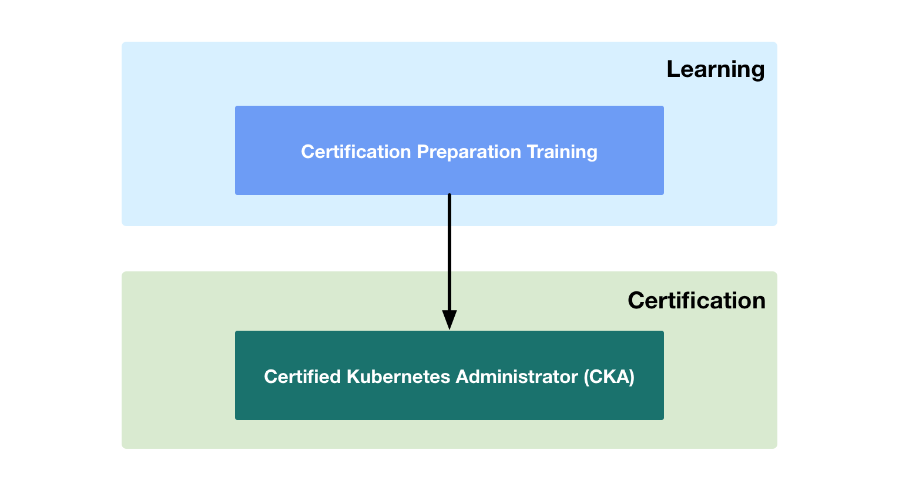

# Expert

---

The **expert** training is designed to help the learner pass the [**CNCF Certified Kubernetes Administrator (CKA)**](https://github.com/cncf/curriculum/blob/master/certified_kubernetes_administrator_exam_V0.9.pdf) exam.

## Certification Preparation Training

Training that is designed to ensure that a learner has the requisite skills necessary to pass the CNCF Certified Kubernetes Administrator (CKA) exam.

## Certified Kubernetes Administrator (CKA) 

The learner takes the CNCF CKA exam.

  