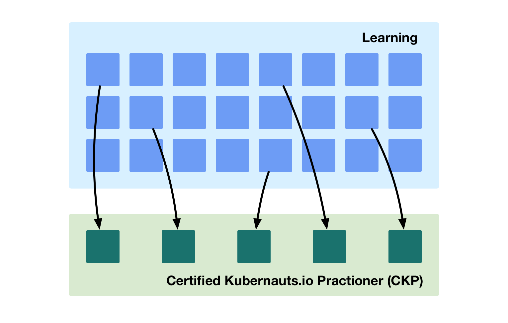

# Master

---

At the **master** level the learner can select from many **advanced domain specific training** courses.  To pass the **Kubernauts** exam and become a **Certified Kubernauts.io Practioner (CKP)** the learner must pass five tests selected from the advanced domains.

## Advanced Domain Specific Training

Training that teaches how to use CNCF projects, as well as other relevant technologies, to deliver domain specific solutions.

Open Datacentre [solutions](http://docs.opendatacentre.io/reference/solution.html) are used as the basis for the training.

 
## Courses

There will be an increasing number of domain specific courses.

| Course                        | Description                      |
| :---------------------------- | :------------------------------- |
| **CI/CD**                     | |
| **Microservice**              | |
| **Service Mesh**              | |
| **Application Architectures** | |
| **Storage**                   | |
| **Security**                  | |
| **Metrics**                   | |
| **Logging**                   | |
| **Tracing**                   | |
| **Networking**                | |
| **Package Management**        | |
| **Performance**               | |
| **Testing**                   | |
| **Federation**                | |
| **Operators**                 | |
| **Batch Jobs**                | |
| **Machine Learning**          | |
| **Databases**                 | |
| **Advanced k8s Topologies**   | |

  