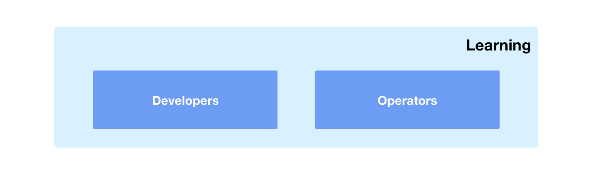

# Proficient

---

The **proficient** training is split between **developers** and **operators** learning streams.  The training is designed to teach skills that are relevant to the particular role.

| Role           | Description                 |
| :------------- | :-------------------------- |
| **Developers** | How to use Kubernetes to develop applications. |
| **Operators**  | How to use Kubernetes to deliver a PaaS to the developers. |

